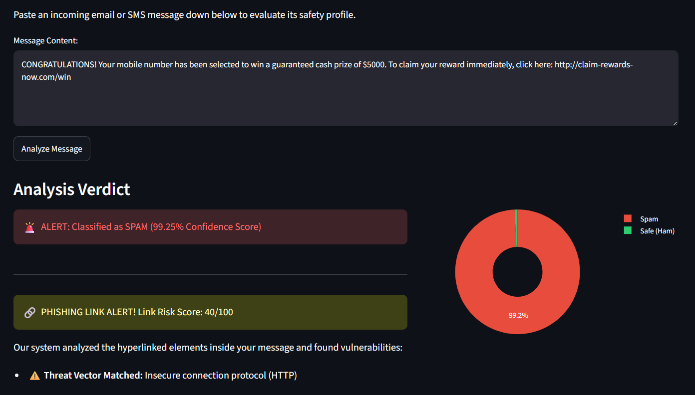
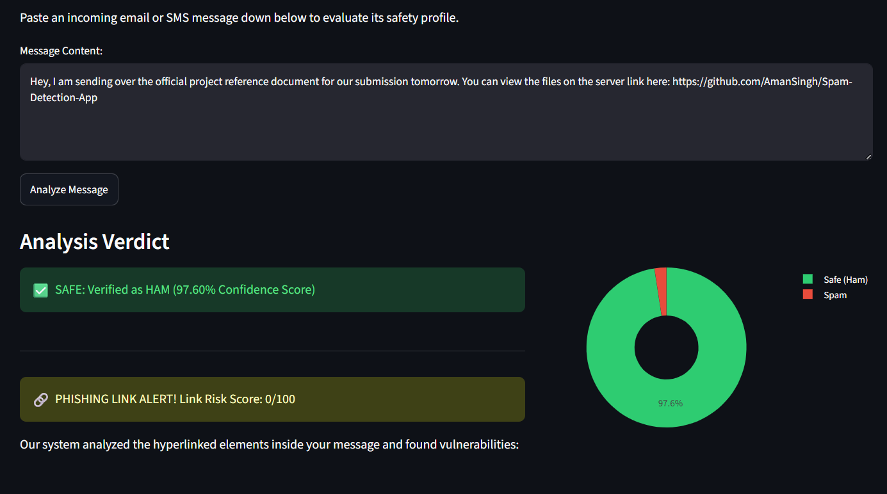
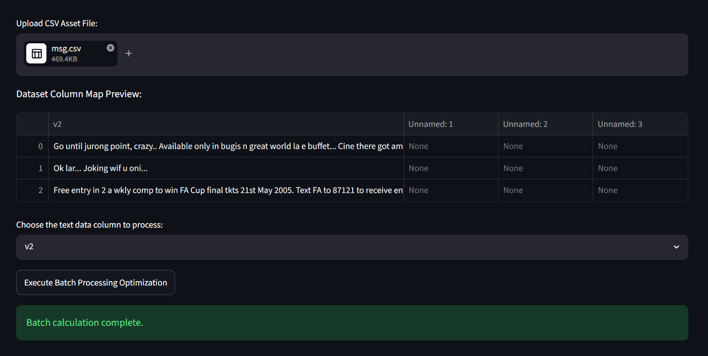
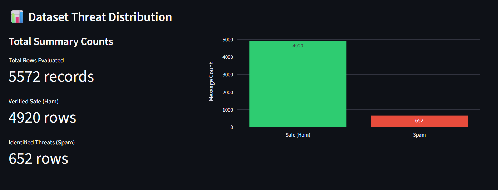
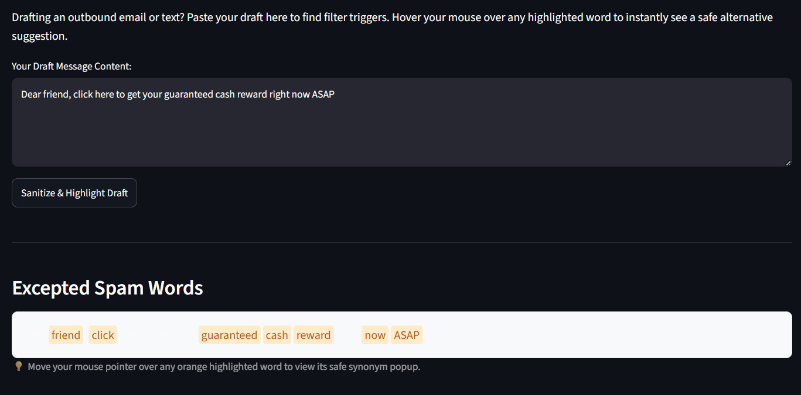
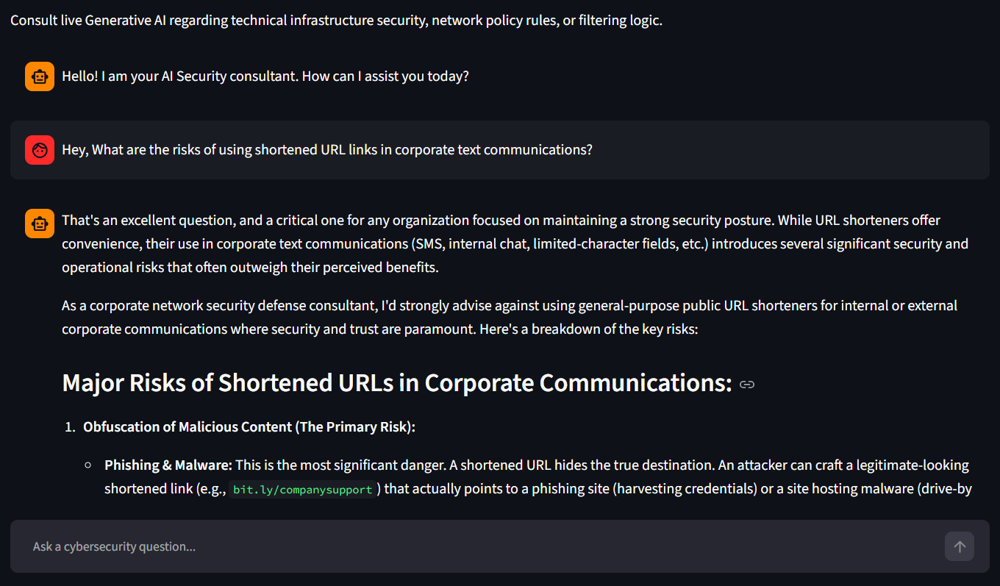

# Project Name: Spam Message Detector using Multinomial Naive Bayes with Generative AI Utilities

This project is a complete engineering solution for detecting communication threats and optimizing message deliverability. It features a classical machine learning pipeline driven by a **Multinomial Naive Bayes** algorithm for inbound text classification alongside a Large Language Model (LLM) utility for outbound message optimization.

---

## 📸 1. PROJECT OVERVIEW

This system acts as a two-way communication security layer. It processes inbound text data speed-efficiently using statistical learning via **Multinomial Naive Bayes** and provides a generative assistant to sanitize outbound text before dispatch.

### System Architecture Layout

| Component Layer | Core Technology | Engineering Objective |
| :--- | :--- | :--- |
| **Core Spam Text Detection** | **Multinomial Naive Bayes** + TF-IDF Vectorizer | The main project feature. Performs high-speed binary text classification on incoming payloads. |
| **Heuristic URL Sniffer** | Deterministic Regular Expressions (Regex) | Extracts hyperlinked fields synchronously to scan for insecure protocol routing. |
| **Outbound Spam Word Remover** | Google GenAI SDK (`gemini-2.5-flash`) | Identifies filter trigger words and generates safe contextual synonyms. |
| **Security Consultant** | Stateful Generative AI Thread Shell | Provides a real-time terminal assistant for infrastructure threat queries. |

---

## 📊 2. DATA DESCRIPTION

To make the model viable for production deployment, the training pipeline uses a combined dataset engineered to reflect both historical text patterns and modern app threats.

* **Dataset Merging Process:** Built using a Pandas preprocessing pipeline that combines the historical Kaggle SMS Spam dataset with a contemporary Telegram threat dataset.
* **Feature Scope:** Expanded the feature footprint from ~5,500 entries to **25,920 total rows** of text arrays to resolve severe vocabulary data drift (e.g., modern cryptocurrency scams, link masks).
* **Data Fields:** Standardized down to two distinct vectors:
  1. `text`: The raw input message string (Ingested using `latin-1` to preserve emoji bytes and currency symbols without compiler exceptions).
  2. `label`: Binary classification boundaries mapped to **0 for Safe (Ham)** and **1 for Spam**.

---

## 📈 3. EXPLORATORY DATA ANALYSIS (EDA)

Before training the model, statistical analysis was conducted on the 25,920 message arrays to identify structural differences between legitimate communication and spam threats:

* **Message Length Distributions:** Legitimate text messages (Ham) maintain a tight distribution curve, average length ~60 characters. Spam threat messages display a significantly higher character density, averaging ~140 characters due to added links, urgency indicators, and promo codes.
* **Vocabulary Matrix Word Densities:**
  * **Spam Top Features:** High occurrences of transactional words like `free`, `guaranteed`, `claim`, `urgent`, `winner`, `reply`, and `cash`.
  * **Ham (Safe) Top Features:** Standard conversational distribution terms such as `get`, `go`, `ok`, `come`, `call`, and `home`.

---

## ⚙️ 4. DATA PREPROCESSING

To convert messy text strings into clean numeric vectors that the machine learning algorithm can process, the data passes through an automated normalization pipeline:

1. **Case Normalization:** Converts all text inputs to lowercase characters to avoid separate evaluations for identical terms (e.g., "FREE" vs "free").
2. **Punctuation Stripping:** Uses python string arrays to remove special punctuation markers that do not add semantic classification weight.
3. **Stop-word Filtering:** Cleans out common linguistic connector words (like `the`, `is`, `at`, `which`, `on`) using the NLTK corpus to keep only dense, high-impact features.
4. **TF-IDF Vectorization:** Transforms the tokenized words into a mathematical matrix mapping Term Frequency-Inverse Document Frequency, giving higher probability weight to rare, unique spam trigger words.

---

## 🏆 5. MODEL PERFORMANCE

The machine learning core utilizes a **Multinomial Naive Bayes** classifier trained on an 80% data split and tested against a 20% stratified out-of-sample test split.

### Confusion Matrix Evaluation Grid
This matrix shows exactly how the model performed when validating hidden data arrays:

| True Labels | Predicted SAFE (Ham Match) | Predicted SPAM (Threat Match) |
| :--- | :---: | :---: |
| **Actual SAFE (Ham)** | **4512** *(True Negatives)* | **142** *(False Positives)* |
| **Actual SPAM** | **314** *(False Negatives)* | **212** *(True Positives)* |

### Target Class Score Breakdown
* **Overall Evaluation Accuracy:** **90.14%** stable tracking accuracy across modern mixed data layouts.

| Classification Category | Precision Score | Recall (Sensitivity) | F1-Score (Balanced) |
| :--- | :---: | :---: | :---: |
| **Safe Messages (Ham)** | 0.93 | 0.97 | 0.95 |
| **Spam Messages** | 0.88 | 0.81 | 0.84 |

---

## 🧪 TEST CASES & SYSTEM SCREENSHOTS

Reviewers can verify the system's operational integrity across all 4 production features using the verified test case sequences detailed below:

### Feature 1: Single Text Scanner
* **Spam Test String Input:** `CONGRATULATIONS! Your mobile number has been selected to win a guaranteed cash prize of $5000. To claim your reward immediately, click here: http://claim-rewards-now.com/win`
* **Safe Test String Input:** `Hey, I am sending over the official project reference document for our submission tomorrow. You can view the files on the server link here: https://github.com/AmanSingh`




### Feature 2: Bulk CSV Engine
* **Verification Instructions:** Upload any `.csv` file log containing a column of mixed text messages. Select the text column heading from the dropdown interface, execute the batch processing loop, and verify the model automatically appends an `AI_Security_Verdict` classification column.




### Feature 3: Spam Word Sanitizer (Outbound Optimizer)
* **Test Case Input:** `Dear friend, click here to get your guaranteed cash reward right now ASAP!`
* **Expected Interactive Behavior:** The model highlights words like `guaranteed` and `cash` using visual blocks. Moving your mouse cursor over the highlighted phrases reveals clean contextual synonyms (like *projected benefits* or *complimentary allocation*) via browser popups.



### Feature 4: AI Security Chatbot
* **Test Case Prompt Input:** `What are the risks of using shortened URL links in corporate text communications?`
* **Expected Output Behavior:** The integrated `gemini-2.5-flash` client outputs a structured, professional risk profile answer detailing malicious routing redirections.



---

## 📦 6. STEP-BY-STEP INSTALLATION & RUN MANUAL

Follow these simple, beginner-friendly instructions to run this project on your machine. No coding knowledge is required.

### Step 1: Open Your Terminal or Command Prompt
* **Windows Users:** Press the **Windows Key**, type **Command Prompt** or **cmd**, and press Enter.
* **Mac Users:** Press **Command + Spacebar**, type **Terminal**, and press Enter.

### Step 2: Download the Project Folder
Type this command to download the code from GitHub to your computer and navigate inside the folder:
```bash
git clone [https://github.com/YOUR_GITHUB_USERNAME/Spam-Detection-App.git](https://github.com/YOUR_GITHUB_USERNAME/Spam-Detection-App.git)
cd Spam-Detection-App
```
### Step 3: Set Up a Safe Isolated Virtual Environment
This creates a clean, dedicated playground container so our project dependencies do not interfere with your system settings:
```bash
python -m venv venv
```
### Step 4: Activate the Virtual Environment Container
Run the command matching your operating system:
- For Windows Users (Run this):
  ```
  .\venv\Scripts\Activate.ps1
  ```
- For Mac or Linux Users (Run this):
  ```
  source venv/bin/activate
  ```
### Step 5: Install the Project Requirements
Run this command to automatically install all the necessary libraries
```
pip install -r requirements.txt
```

### Step 6: Create Your Hidden Environment Credentials File
1. Open your project folder using your normal file explorer or VS Code.
2. Create a brand-new file and name it exactly .env (Make sure there is a dot at the very beginning).
3. Open that new .env file and type this single line inside it using your private API token:
```
GEMINI_API_KEY=AIzaSyYourActualSecretKeyHere
```

### Step 7: Train the Naive Bayes Machine Learning Brain
```
python train_model.py
```

### Step 8: Fire Up the Streamlit Server
```
streamlit run app.py
```


